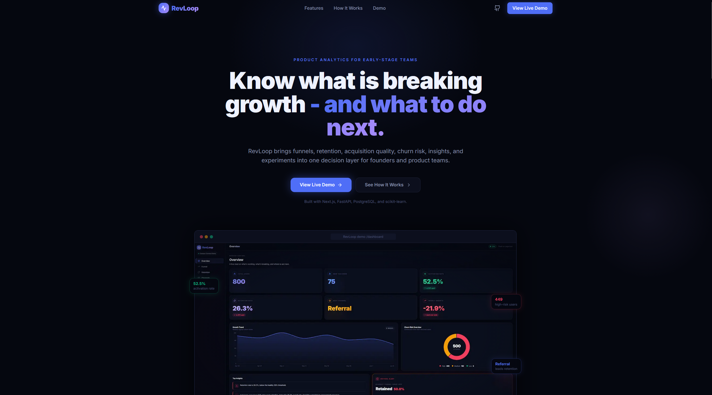
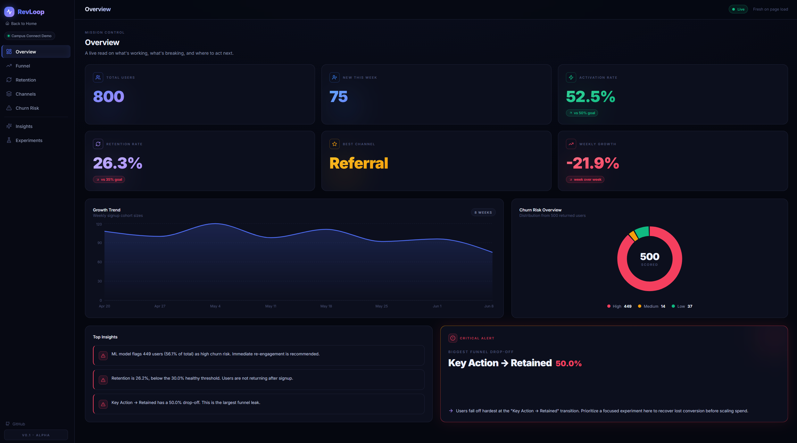
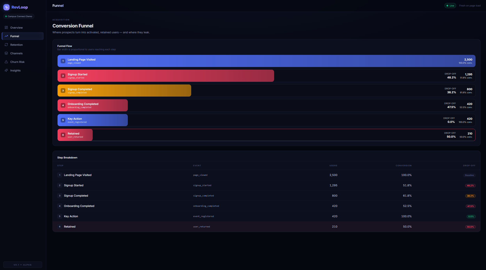
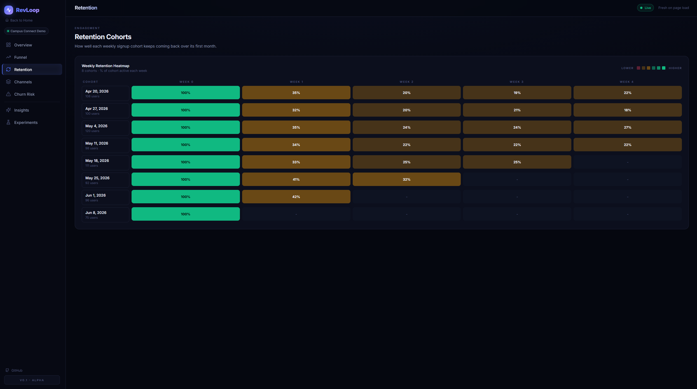
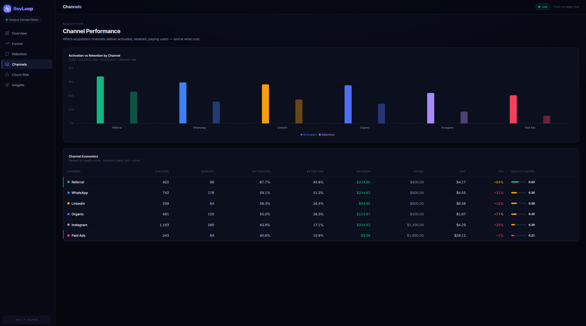
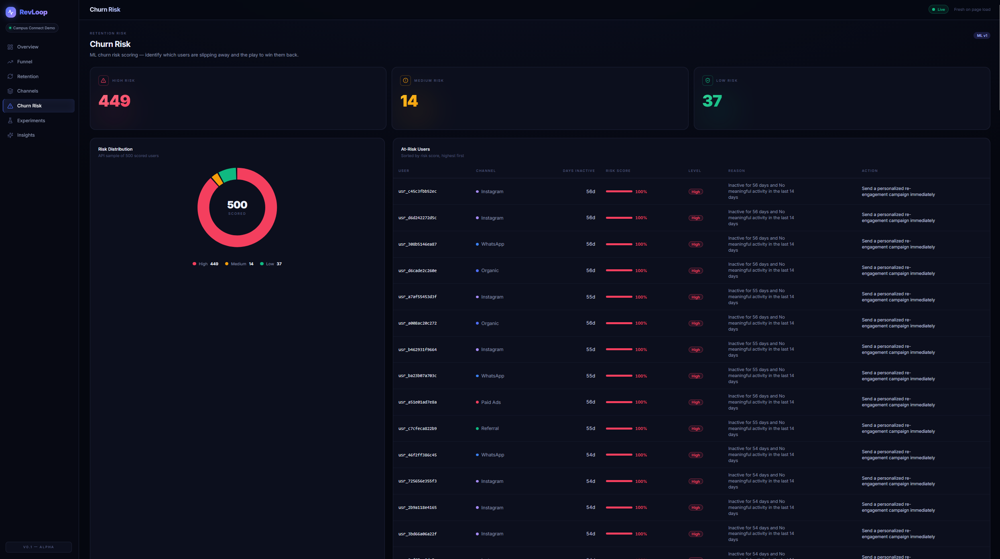
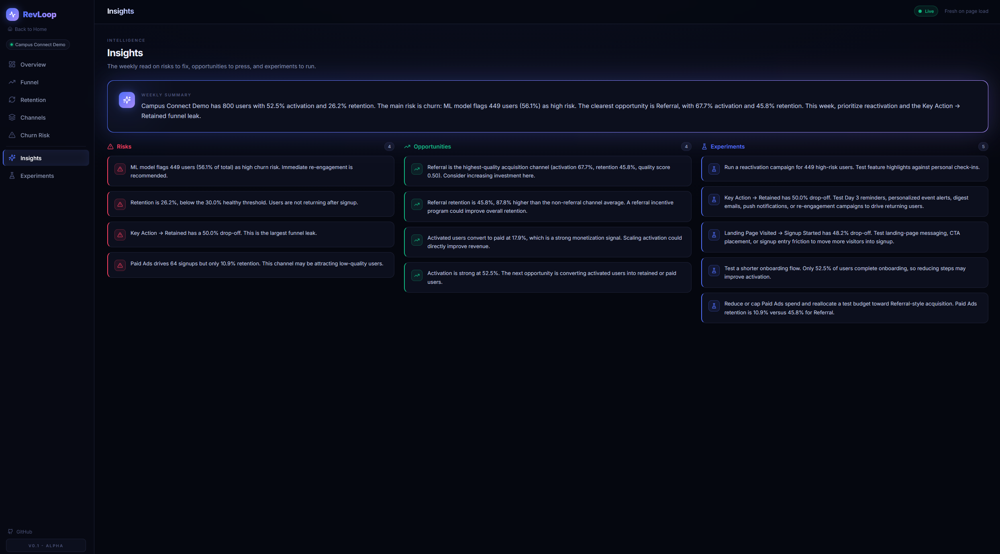
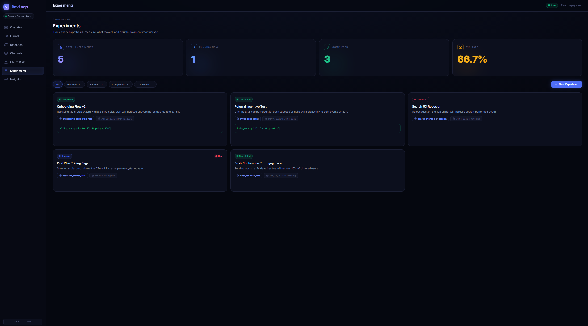
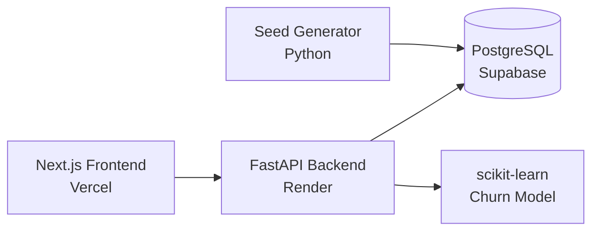

# RevLoop

ML-powered product analytics for early-stage teams.

**Live Demo:** https://rev-loop.vercel.app
**Backend API:** https://revloop.onrender.com
**GitHub:** https://github.com/ryanshaon/RevLoop

> Note: The backend runs on Render's free tier, so the first request after inactivity may take 30–50 seconds.

---

## What RevLoop Does

RevLoop answers five questions an early-stage product team asks every week:

1. Which acquisition channels bring users who actually retain?
2. Where are users dropping off in the funnel?
3. Which users are most likely to churn?
4. Is product health improving or getting worse?
5. What should the team test next?

It answers these from raw event data — no SQL, no spreadsheet exports, no analyst required.

## Demo Dataset

All data is simulated for a fictional product called **Campus Connect Demo**. This is not live customer data.

- 800 users
- 20,478 events
- 6 acquisition channels
- 8 weeks of activity
- 5 seeded growth experiments

The dataset is built with intentional channel quality differences: **Referral** has the strongest retention (45.8%), **Paid Ads** the weakest (10.9%) despite higher spend. Overall activation is 52.5% and overall retention (users who returned after signup week) is 26.2%. The ML churn model flags roughly 440 of the 800 users as high risk, reflecting how aggressively the simulated dataset skews toward inactivity.

## Screenshots

| Landing Page | Dashboard |
|---|---|
|  |  |

| Funnel Analysis | Retention Cohorts |
|---|---|
|  |  |

| Channel Performance | Churn Risk |
|---|---|
|  |  |

| Insights | Experiment Tracker |
|---|---|
|  |  |

## Core Features

- **Landing page** — marketing entry point introducing the product before the dashboard.
- **Product health dashboard** — activation, retention, growth, and acquisition KPIs in one summary view.
- **Funnel analysis** — conversion and drop-off rate between each real product stage (visitor → signup → activation → retention → revenue).
- **Retention cohorts** — weekly cohort grid aligned to calendar weeks, not signup-relative days.
- **Channel performance** — activation rate, retention rate, CAC, and ROI/quality scoring across all 6 acquisition channels.
- **ML churn risk** — Logistic Regression classifier scores every user, with automatic fallback to deterministic rule-based scoring if model artifacts are missing.
- **Data-driven insights engine** — deterministic, metrics-based weekly risks, opportunities, and experiment suggestions (no LLM call involved).
- **Experiment tracker** — full CRUD experiment log with status transitions, soft cancellation, and win-rate stats.
- **Responsive dark UI** — built with custom Tailwind components, not a third-party UI kit.
- **Production deployment** — live across Vercel, Render, and Supabase.

## Architecture



- The frontend calls typed API functions and renders the dashboard, funnel, retention, channel, churn, insights, and experiment views.
- FastAPI computes every metric from raw event rows on request and serves the model-backed churn risk endpoint.
- PostgreSQL stores organizations, users, events, campaigns, revenue events, experiments, and insights.
- The churn model loads committed artifacts (`model.pkl`, `scaler.pkl`, `feature_columns.json`) from `backend/ml/`.

## Tech Stack

| Layer | Technology |
|---|---|
| Frontend | Next.js 14, TypeScript, Tailwind CSS, Recharts, Framer Motion, lucide-react, custom UI components |
| Backend | FastAPI, SQLAlchemy, Pydantic, PostgreSQL, psycopg2 |
| ML/Data | scikit-learn, pandas, NumPy, joblib |
| Database | PostgreSQL locally, Supabase PostgreSQL in production |
| Deployment | Vercel (frontend), Render (backend), Supabase (database) |

## Technical Decisions Worth Knowing

### Logistic Regression over Random Forest

Both models were trained on the same 14-feature pipeline. The Random Forest benchmark reached 100% accuracy and a 0.0002 Brier score — a sign of label leakage rather than a good model: the churn label (`churn = 1` when `days_since_last_active >= 14`) is built directly from a feature the model also sees, so a tree-based model can memorize the threshold instead of learning a real pattern. Logistic Regression was served instead. It scores 98.1% accuracy, ROC-AUC 0.9997, and a 0.0113 Brier score, while producing smooth, calibrated probabilities across the user base instead of the Random Forest's near-binary outputs — which is what a risk score needs to be useful for prioritizing outreach. Full metrics for both models are checked into [`backend/ml/model_metadata.json`](backend/ml/model_metadata.json), including an explicit `limitations` note that these metrics shouldn't be read as production generalization evidence.

### Shared training and serving pipeline

[`backend/ml/features.py`](backend/ml/features.py) builds the feature DataFrame from raw `Event`/`User`/`RevenueEvent` rows, and both `train_churn_model.py` and `predict.py` import the same `build_user_features()` function. There is no separate training query and serving query to drift apart — train/serve skew is structurally avoided because there's only one feature code path.

### Calendar-aligned retention

Retention cohorts group users by the calendar week their signup falls into (`signup_date - timedelta(days=signup_date.weekday())`), not by days relative to each user's own signup. This makes cohort rows directly comparable across users with different signup dates, matching how product teams actually read a retention table.

### Rule-based insights instead of an LLM call

The insights engine ([`backend/app/services/metrics.py`](backend/app/services/metrics.py)) generates weekly risks, opportunities, and experiment suggestions from hard thresholds against real query results — for example, flagging a channel with over 50 signups and under 15% retention. This is deterministic, free to run, has no latency variance, and every sentence it produces is traceable back to a specific number in the database. An LLM summarizer could be layered on top later, but the current implementation intentionally avoids a black-box or paid API dependency.

## API Reference

| Method | Endpoint | Description |
|---|---|---|
| GET | `/health` | API and database health check |
| GET | `/api/dashboard/summary` | Product health summary (activation, retention, growth, acquisition) |
| GET | `/api/funnel` | Multi-step funnel conversion and drop-off rates |
| GET | `/api/retention` | Weekly retention cohort grid |
| GET | `/api/channels/performance` | Channel-level CAC, retention, and ROI scoring |
| GET | `/api/churn-risk` | Per-user churn risk ranking (ML model, falls back to rule-based) |
| GET | `/api/insights/weekly-summary` | Weekly risks, opportunities, and experiment recommendations |
| GET | `/api/experiments` | List all experiments |
| GET | `/api/experiments/stats` | Experiment win-rate and status stats |
| POST | `/api/experiments` | Create a new experiment |
| PATCH | `/api/experiments/{experiment_id}` | Update an experiment's status or results |
| DELETE | `/api/experiments/{experiment_id}` | Soft-cancel an experiment |

Interactive API docs are available locally at `http://127.0.0.1:8000/docs`. (Not verified against the production Render URL — confirm before relying on it there.)

## Run Locally

**Prerequisites:** Node.js 18+, Python 3.11+, PostgreSQL 14+, `psql`

```powershell
git clone https://github.com/ryanshaon/RevLoop.git
cd RevLoop
```

**Database:**

```powershell
createdb -U postgres revloop
psql -U postgres -d revloop -f backend/schema.sql
psql -U postgres -d revloop -f backend/scripts/generated_data/seed.sql
```

**Backend:**

```powershell
cd backend
python -m venv .venv
.\.venv\Scripts\Activate.ps1
pip install -r requirements.txt
Copy-Item .env.example .env
python -m uvicorn app.main:app --reload --host 127.0.0.1 --port 8000
```

**Frontend** (second terminal):

```powershell
cd frontend
Copy-Item .env.example .env.local
npm install
npm run dev
```

Open `http://localhost:3000`.

macOS/Linux:

```bash
cp .env.example .env
source .venv/bin/activate
```

## Project Structure

```text
RevLoop/
  backend/
    app/
    ml/
    scripts/
    schema.sql
  frontend/
    app/
    components/
    lib/
    public/
  docs/
    screenshots/
    product-brief.md
    event-taxonomy.md
```

## Limitations and Next Steps

- Demo data is simulated, not real customer usage — it exercises realistic patterns but can't validate things real behavior would surface (seasonality, support-ticket correlation with churn, etc.).
- Model metrics are unusually strong because the churn label is based heavily on inactivity recency, and recency is also a feature — see the `limitations` note in `model_metadata.json`.
- Render's free tier cold-starts after inactivity, which is the most common point of confusion for anyone trying the live demo cold.
- The insights engine is deterministic; a future iteration could add an LLM summarizer on top of the existing numbers without replacing the rule-based logic underneath.
- No authentication or multi-tenant user management yet — every endpoint is org-scoped by query parameter, not by login.

## What This Project Demonstrates

- Full-stack product engineering across data, API, and frontend layers
- Product analytics and metric design (funnel, retention, acquisition, churn)
- ML model training and serving with a shared feature pipeline
- Explainable, traceable decision systems over black-box automation
- Data visualization and dashboard UI/UX
- Deployment across frontend, backend, and database providers
- Business and product thinking beyond feature implementation

---

Portfolio project by Ryan — built to learn full-stack product analytics, not a commercial product.
